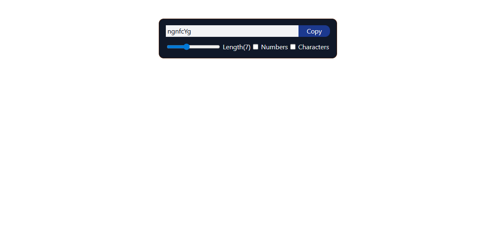
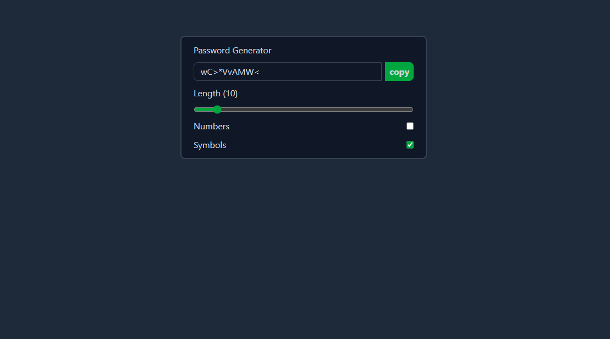

# Password Generator 🔐

A React password generator built as a learning project to practice and understand React hooks step by step.

This project shows the progression from a basic implementation to an improved and optimized version.

---

## Features
- Generate random passwords
- Adjustable password length
- Optional inclusion of numbers and symbols
- Copy password to clipboard
- Responsive UI built with Tailwind CSS

---

## Learning Focus
This project was created to practice:
- `useState`
- `useEffect`
- `useRef`
- `useCallback`

---

## Versions

### Version 1
- Built independently without following tutorials
- Uses `useState`, `useEffect`, and `useRef`
- Basic password generation logic

---

### Version 2
- Improved after learning `useCallback`
- Cleaner logic and better structure
- Improved UI and performance

---

## Tech Stack
- React
- Vite
- JavaScript
- Tailwind CSS

---

## Purpose
This project is part of my React learning journey, focusing on understanding hooks deeply by building and improving the same project incrementally.
